  

<svg width="900" height="280" viewBox="0 0 900 280" xmlns="http://www.w3.org/2000/svg">
  <defs>
   

# Hey, I'm Ninshad 👋

**Cybersecurity Practitioner · Tool Builder · Founder**  
📍 Kochi, Kerala → Open to remote & relocation worldwide  
🔍 Actively seeking SOC Analyst / Junior Pen Tester / Security Analyst roles

---

## 🛠️ What I've Built

| Project | What it does | Stack |
|---|---|---|
| [KUMARAN](https://github.com/ninshad2004/Kumaran) | CLI network security scanner — ethical recon & risk scoring | Python, Nmap |
| [Job Hunter Agent](https://job-hunter-agent-eight.vercel.app) | Live web app that automates job searching & filtering | HTML, JS, Vercel |
| UPI SafeScan | AI-powered UPI QR fraud detection before payment | Python, TensorFlow |
| Cyvron | Cybersecurity consultancy for SMBs in Kerala | FastAPI, Nuclei |

---

## ⚔️ Skills & Tools

**Offensive:** Metasploit · Nmap · Burp Suite · Nikto · SQLMap · OWASP ZAP  
**Defensive:** Wazuh · Splunk · Wireshark · Snort · ELK Stack · Sysmon  
**Intel & Forensics:** MITRE ATT&CK · OSINT · YARA · Digital Forensics · CVSS v3.1  
**Dev:** Python · Bash · PowerShell · Linux (Kali daily driver) · HTML/CSS/JS

---

## 📜 Certifications (In Progress)

- 🎯 CEH v13 — EC-Council · Expected Aug 2026  
- 🎯 CSA — EC-Council · Expected Oct 2026  
- 🎯 CHFI — EC-Council · Expected Dec 2026

---

## 📬 Let's Connect

> 💡 *21 · Fresher · Building in public · Open to anywhere*
